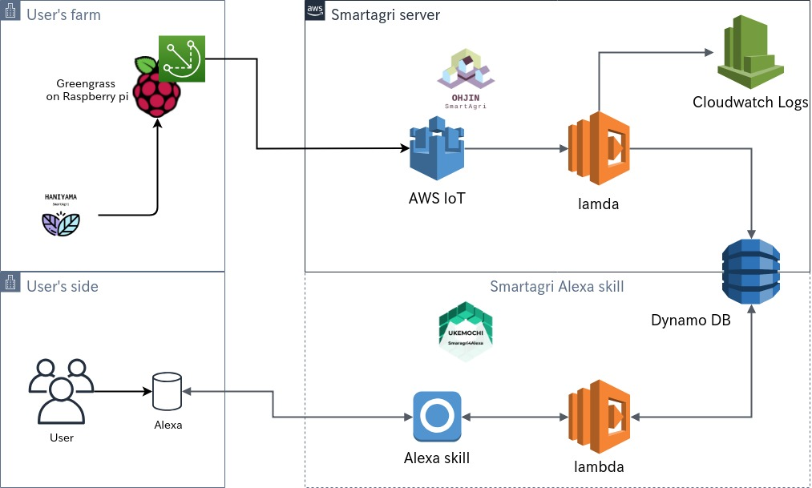

# Smartagri4Alexa

This is alexa skill for [Smartagri](https://github.com/hatobus/Smartagri)

## Using 

- AWS lambda
- Amazon Alexa
- Golang

## Work flow 

1. Amazon Alexa request for AWS lambda.
2. To Get request and get information from VPS server.
3. VPS return JSON.
4. To perse JSON attach to request.
5. lambda return json for Alexa
6. Alexa speaking.

## exsample (lang:ja)

**To request full information **

「アレクサ、{machineNO}の情報を教えて」

「{machineNO}の情報は、温度は15.71度、湿度は71.97パーセント、水分量は0.00パーセント、二酸化炭素濃度は190.00ppm、照度は9539.00ルクスです。この情報は{time}に取得された情報です。」

## Copyright

If you want to information of this repository licence.

You'll see ./LICENSE

Guard object of logger for debugging.
Copyright (c) 2018 Haga Fumito <s1240056@gmail.com>
